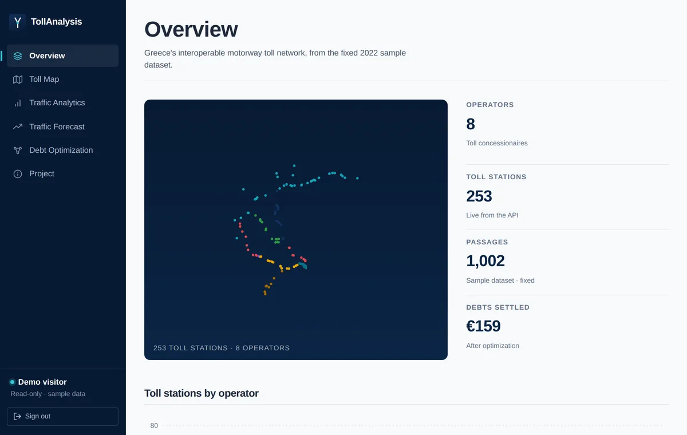
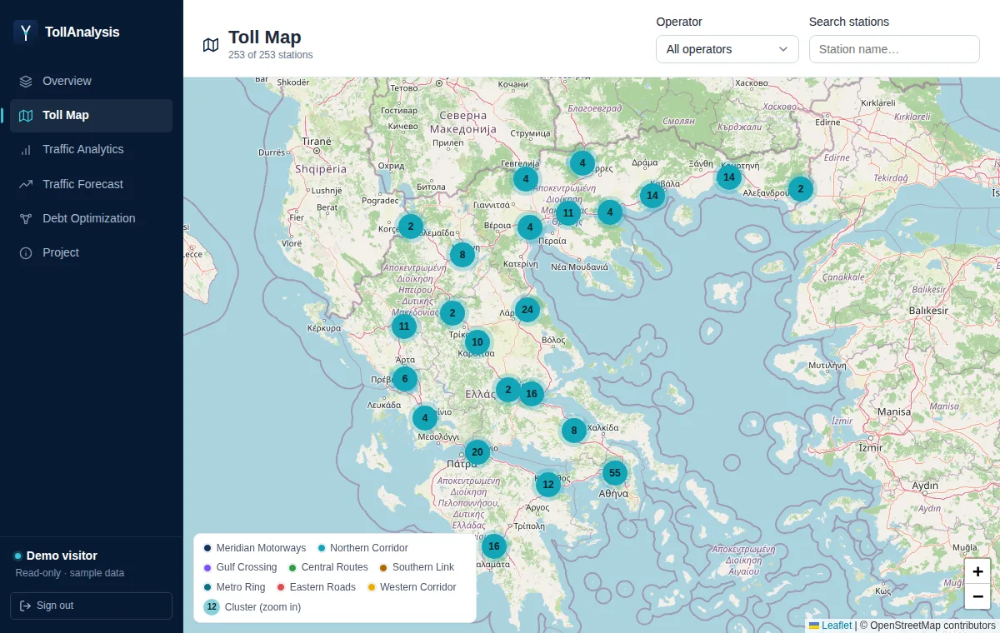
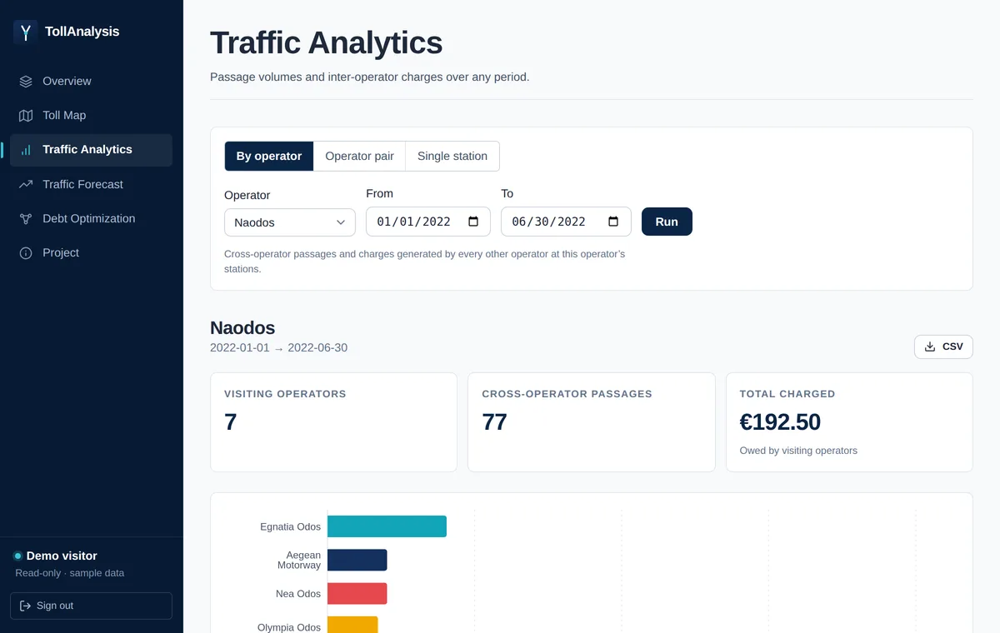
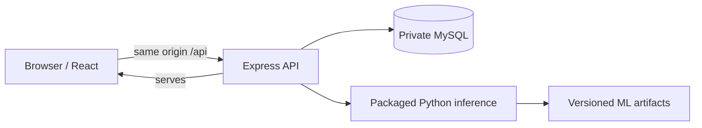

# TollAnalysis

**An interactive full-stack platform for exploring toll stations, traffic flows, cross-operator charges, and settlement networks across a Greek-inspired road system.**

TollAnalysis is an independent educational portfolio application with a secured, read-only public-demo mode. It is deployment-ready, but no public deployment is currently running.

> Passages, debts, contacts, and public operator names are fictional. Geography is used for demonstration only; this project is not affiliated with, endorsed by, or operated by any Greek motorway operator.

## Product preview

| Overview | Toll Map | Traffic Analytics |
| --- | --- | --- |
|  |  |  |

The browser demo also includes Forecasting Integration and an interactive before/after PyVis debt-optimization graph. Start it with **Explore Live Demo**; no password is published or required. After starting a session, the graph is available at [`/debts`](http://localhost:9115/debts).

## What it does

- Explores 253 toll stations across eight fictional display operators.
- Analyses operator totals, operator pairs, and individual-station passages; supported views export CSV.
- Runs pre-trained Python/scikit-learn volume and peak-hour inference.
- Shows a precomputed debt-netting result as a settlement table and interactive before/after graph.
- Provides a short-lived, platform-wide, read-only demo identity.

## Features and access

Landing/demo entry starts `POST /api/auth/demo-login` with no input. The app includes Overview, a clustered/filterable Toll Map, three Traffic Analytics modes (by operator, pair, station), Forecasting Integration, Debt Optimization with a sandboxed PyVis graph, and a Project/methodology page.

| Capability | Anonymous browser visitor | Read-only demo user | Company user (local) | Admin (local) |
| --- | ---: | ---: | ---: | ---: |
| Landing, Project, and static content | yes | yes | yes | yes |
| Browser Toll Map (`/map`) | yes | yes | yes | yes |
| Public toll data API (`GET /api/tolls`) | yes | yes | yes | yes |
| Authenticated Overview | no | yes | yes | yes |
| Analytics and forecasting | no | yes | yes, subject to company scope when enabled | yes |
| Debt visualization | no | yes | yes | yes |
| Upload/import, training, reset, and other mutations | no | no | no | admin only when explicitly enabled |

An anonymous visitor can open the browser map directly; it reads the intentionally public `GET /api/tolls` endpoint. That is the only unauthenticated toll/traffic data endpoint. Health, liveness, public configuration, and API documentation endpoints are also unauthenticated, but expose operational metadata or documentation rather than traffic data. All other application pages that show analytics, forecasts, or debts require a valid demo or local-user session.

Stable internal codes (`AM`, `EG`, `GE`, `KO`, `MO`, `NAO`, `NO`, `OO`) and legacy role strings remain for API, database, and model compatibility; they are identifiers, not public brands.

| Code | Fictional display alias |
| --- | --- |
| AM | Meridian Motorways |
| EG | Northern Corridor |
| GE | Gulf Crossing |
| KO | Central Routes |
| MO | Southern Link |
| NAO | Metro Ring |
| NO | Eastern Roads |
| OO | Western Corridor |

## Architecture



One container serves the React build and Express API on the same origin, avoiding browser CORS complexity. MySQL remains private behind that application endpoint.

## Engineering highlights

Stavros Mitropoulos completed the later `portfolio-demo` overhaul; the original team-project attribution is retained below.

- **Product and demo experience:** responsive React pages, a public Toll Map, and a short-lived read-only demo session with no published credentials.
- **Full-stack architecture:** one same-origin application container serves the React build and Express API, backed by a private MySQL service with deterministic initialization and pooled connections.
- **Authentication and authorization:** JWT-based roles separate demo, company, and admin capabilities; operator-scoped analytics can enforce company isolation.
- **Runtime security and reliability:** production configuration fails closed, destructive operations can be disabled, health endpoints distinguish liveness from database readiness, and user-facing errors avoid internals.
- **ML inference integration:** versioned Python/scikit-learn artifacts are invoked through bounded inference requests and documented with chronological evaluation and explicit sample-data limits.
- **Testing and reproducibility:** frontend, backend, disposable-database integration, ML-container, browser-journey, and visual smoke checks cover the packaged stack.
- **Deployment readiness:** Docker Compose, environment/secrets guidance, database lifecycle notes, and platform health checks support a future deployment without claiming one exists today.

## Honest ML scope

The included dataset has **1,002 fictional/sample passages across about 15 dates**. The models are not production-grade traffic predictors and often do not outperform simple baselines. They demonstrate reproducible preprocessing, artifact versioning, inference serving, and honest evaluation. A real system would need substantially more real historical data. See [ML methodology](docs/ML_METHODOLOGY.md).

## Quick start

These commands assume the completed repository has been cloned from its default `main` branch.

```bash
git clone https://github.com/StavrosMitro/TollAnalysisWebApp.git
cd TollAnalysisWebApp
export JWT_SECRET="$(openssl rand -hex 32)"
export PUBLIC_DEMO_MODE=true
export DISABLE_DESTRUCTIVE_OPS=true
docker compose up --build -d
curl -fsS http://localhost:9115/livez
curl -fsS http://localhost:9115/healthz
```

Open <http://localhost:9115>, then click **Explore Live Demo**. Stop without deleting local data: `docker compose down`.

To remove the local database volume, use `docker compose down -v` only after confirming this is the disposable local demonstration stack; it permanently deletes local data.

## Demo API examples

Set `BASE` to `http://localhost:9115` locally (replace it with the future live URL when available).

```bash
BASE=http://localhost:9115
TOKEN="$(curl -fsS -X POST "$BASE/api/auth/demo-login" | jq -er '.token')"

curl -fsS -H "x-observatory-auth: $TOKEN" \
  "$BASE/api/chargesBy/NAO/20220101/20220114" | jq .
curl -fsS -H "x-observatory-auth: $TOKEN" \
  "$BASE/api/forecast/NAO/20220114" | jq .
curl -fsS "$BASE/api/tolls" | jq '.[0:3]'

# The demo identity is not an admin identity, so this mutation is denied: 403.
curl -sS -o /dev/null -w '%{http_code}\n' -X POST \
  -H "x-observatory-auth: $TOKEN" "$BASE/api/upload_passages"
```

Browser sessions are short-lived, fictional, platform-wide, and read-only.

## Configuration, testing, and deployment

Use [`.env.example`](.env.example) for local Compose overrides. Important non-secret settings include `PUBLIC_DEMO_MODE`, `DISABLE_DESTRUCTIVE_OPS`, `TRUST_PROXY`, inference timeout/concurrency, and port/database host settings. `JWT_SECRET` and `PASSWORD` are secrets and belong in a provider secret store, never Git.

```bash
cd front-end && CI=true npm test -- --watchAll=false && CI=true npm run build
cd ../back-end && npm test -- --runInBand && npm run test:integration # Docker required
cd ..
docker compose --profile ml run --rm ml -m ml.tests
docker compose --profile ml run --rm ml -m ml.smoke_test
cd front-end && npm run visual-check # running stack + Chromium required
```

Deploy one application container beside private persistent MySQL, store secrets with the provider, import the fictional seed once into an empty database, configure `/healthz`, and retain backups. Public mode requires `PUBLIC_DEMO_MODE=true` and `DISABLE_DESTRUCTIVE_OPS=true`. Railway is currently recommended, not an existing deployment. See the [deployment runbook](docs/DEPLOYMENT.md).

## Repository map and documentation

```text
front-end/       React application, assets, tests, visual checker
back-end/        Express API, auth, ML bridge, tests, Docker runtime source
db/init/         deterministic schema and fictional Compose seed
docs/            deployment, authorization, ML, debt, and asset documentation
Database_mysql/  preserved academic SQL/material and source data
cli-client/      legacy course CLI client
```

- [Swagger/OpenAPI](http://localhost:9115/api/docs) (when local stack runs)
- [Authorization matrix](docs/AUTHORIZATION.md)
- [ML methodology](docs/ML_METHODOLOGY.md)
- [Deployment guide](docs/DEPLOYMENT.md)
- [Technical debt](docs/TECH_DEBT.md)
- [Third-party assets](docs/THIRD_PARTY_ASSETS.md)

## Limitations, attribution, and disclaimer

The data is fictional and tiny; PyVis depends on runtime CDNs; the legacy importer is disabled publicly; CRA migration is deferred; and real imports would need an atomic background pipeline. There is no claim of real traffic-forecasting accuracy.

The academic foundation was developed by the NTUA ECE Software Engineering team. The contribution split is intentionally explicit:

| Contributor | Verified contribution |
| --- | --- |
| Dimitris Thivaios, Dimitris Liakis, Vassilis Anastasiadis | Original academic application and engineering foundation as a team project with contribution in front-end, back-end, cli-client and documentaation|
| Stavros Mitropoulos | Original academic application with major contribution in REST API/backend development, relational database design, documentation, and API functional testing |
| Stavros Mitropoulos — later `portfolio-demo` line | Product direction and portfolio positioning; frontend/transportation identity; public-demo UX; authentication/authorization hardening; Docker/deployment architecture; reproducible database setup; ML integrity and artifact serving; test expansion; security/dependency hardening; documentation and deployment preparation |

The original application was a group effort; later portfolio-line work listed above is Stavros's own. The display aliases in this README and the application are fictional names layered over stable internal codes, not new legal entities.

No license is currently declared; adding one is a separate decision. Third-party map/photo assets retain their own attribution and terms; see [third-party assets](docs/THIRD_PARTY_ASSETS.md).
